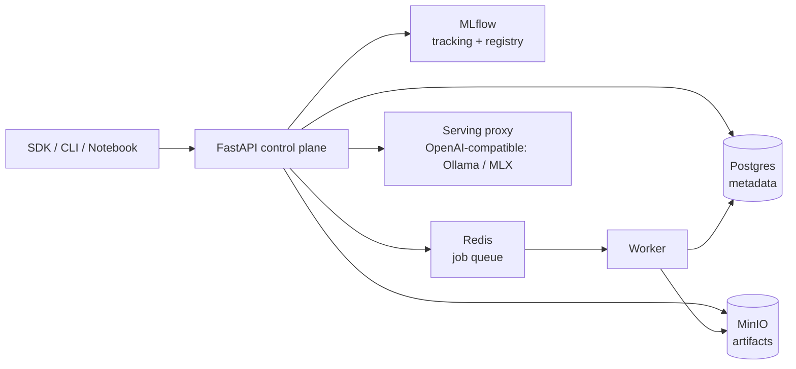

# localml

[](https://github.com/guenp/localml/actions/workflows/ci.yml)

A **local ML experimentation platform** that runs entirely on an Apple Silicon
workstation. It implements the core architecture of a production ML platform at local
scale: a Python SDK, framework adapters, experiment tracking, a model registry, artifact
storage, evaluation jobs, and local model serving.

> Status: **under active development.** The control plane (Phase 1 — durable Postgres-backed
> metadata, lifecycle, idempotency, dataset registry), the Python SDK (Phase 2 — real HTTPX
> client, run tracking, artifact checksums, framework-adapter packaging), and the full
> predict → evaluate → compare loop (Phase 3 — prompt registry, worker-run prediction jobs,
> evaluation jobs with a pluggable metric registry, comparison reports) plus the local
> OpenAI-compatible serving proxy with hot model swap (Phase 4) are implemented and tested.
> Interfaces/DX and quality/ops (Phases 5–6) are next. See
> [`ROADMAP.md`](./ROADMAP.md) for status and [`docs/design.md`](./docs/design.md) for the full
> software design document.

## What's here

```
localml/
├── src/localml/          # Python SDK (`import localml as ml`)
│   ├── adapters/         # torch / jax / mlx / huggingface framework adapters
│   ├── client.py         # HTTPX client for the control plane (retry + idempotency)
│   ├── ops.py            # ml.log_metrics / log_artifact / predict / evaluate / compare / deploy
│   ├── datasets.py       # ml.datasets.register / get
│   ├── prompts.py        # ml.prompts.register / get / render
│   ├── evals.py          # ml.evals.run / register_metric (metric registry)
│   ├── providers.py      # ml.providers.register (serving-backend registry)
│   ├── config.py         # env → ~/.localml/config.toml → defaults
│   ├── exceptions.py     # typed SDK errors
│   ├── run.py            # run context manager
│   ├── types.py          # Run / ModelVersion / PredictionJob / EvaluationJob / Deployment
│   └── cli.py            # Typer CLI
├── services/
│   ├── api/              # FastAPI control plane (+ the worker: `python -m app.worker`)
│   └── mlflow/           # MLflow tracking + registry image
├── docs/                 # Zensical documentation site and design document
├── docker-compose.yml    # Local stack: api, worker, postgres, redis, minio, mlflow, serving
└── tests/
```

## Architecture (at a glance)



The control plane (Postgres) is the source of truth for platform metadata. MLflow holds
experiment tracking state, MinIO holds artifacts, and Redis holds transient job state.

## Quick start

### 1. Bring up the stack

```bash
cp .env.example .env
docker compose up -d
```

This starts Postgres, Redis, MinIO, MLflow, the FastAPI control plane, the worker, and a
local serving runtime.

| Service       | URL                     |
| ------------- | ----------------------- |
| Control plane | http://localhost:8000   |
| API docs      | http://localhost:8000/docs |
| MLflow UI     | http://localhost:5000   |
| MinIO console | http://localhost:9001   |

### 2. Install the SDK

```bash
uv sync           # or: pip install -e .
```

### 3. Run the example workflow

```python
import localml as ml

ml.configure(api_url="http://localhost:8000", token="local-dev-token")

with ml.start_run(project="local", config={"model": "tiny-llm"}) as run:
    ml.log_params({"batch_size": 4, "quantization": "4bit"})
    ml.log_metrics({"baseline_accuracy": 0.82})

    version = ml.huggingface.log_pretrained(
        name="tiny-assistant",
        model_dir="./models/tiny-assistant",
        metadata={"task": "chat", "runtime": "mlx"},
    )

    prompt = ml.prompts.register(name="qa", template="Q: {question}\nA:")
    dataset = ml.datasets.register(project="local", name="evalset",
                                   artifact_uri="datasets/eval.jsonl", rows=rows)

    # Predict-then-eval sugar: runs a prediction job, waits, then scores the stored results.
    eval_job = ml.evaluate(version, dataset, ["exact_match", "latency_p95"],
                           prompt=prompt, provider="echo")
    eval_job.wait()
    print(eval_job.metrics)

    deployment = ml.deploy(model=version, target="local")
    print(deployment.predict({"prompt": "Explain model registries simply."}))
```

### CLI

```bash
localml --help
localml health
localml config --api-url http://localhost:8000
localml runs get <run_id>
localml models get <name>
localml prompts register <name> --template "..."   # or --file prompt.txt
localml prompts render <name> <version> --var key=value
localml predictions run <model:v> <dataset:v> <prompt:v> --config '{"batch_size": 4}'
localml predictions status <job_id>
localml predictions results <job_id>
localml evals run <prediction_job_id> -m exact_match -m error_rate
localml evals status <eval_job_id>
localml compare <job_a> <job_b>
localml deployments create <model:v> --config '{"base_url": "http://localhost:11434"}'
localml deployments swap <deployment_id> --model <model:v>
localml deployments predict <deployment_id> "Explain model registries simply."
```

## Prompt registry

Prompts change more often than models, so they are versioned like one: an experiment is fully
described by **model version + dataset version + prompt version** (e.g. `assistant:v3` +
`eval-set:v1` + `qa:v2`), which is what makes eval results reproducible and comparable.
Templates are plain `str.format` strings; the server extracts the `{placeholders}` at
registration and stores them as the version's `variables`, so a prediction job can check that
a dataset provides every variable *before* running inference. In the prediction loop, the
worker renders the template against each dataset row and sends the result to the model —
register two prompt versions, predict with both, and compare to pick the winner.

```python
import localml as ml

prompt = ml.prompts.register(
    name="qa",
    template="You are a concise assistant.\nQ: {question}\nA:",
)
print(prompt.version, prompt.variables)   # v1 ['question']

# Rendering happens server-side and requires exactly the declared variables —
# a missing or extra variable (e.g. a typo'd dataset column) is an error.
print(prompt.render(question="What is a model registry?"))

ml.prompts.register(name="qa", template="Q: {question}\nThink step by step.\nA:")  # -> qa:v2
print([p.version for p in ml.prompts.get("qa")])  # ['v1', 'v2']
```

Templates are sandboxed: only bare-identifier placeholders like `{question}` are allowed.
Positional fields and attribute/index access (`{obj.attr}`, `{rows[0]}`) are rejected at
registration, so rendering untrusted dataset rows can never traverse into object internals.
Like models and datasets, prompts resolve by `name:version` (`qa:v2`) everywhere references
are accepted.

## Prediction jobs

Batch inference is a background job, decoupled from evaluation: outputs are stored once as a
JSONL artifact and scored separately, so evals can re-run without re-inferring. A job resolves
a **model + dataset + prompt** triple, renders the prompt per dataset row, and sends it to an
inference provider — by default any **OpenAI-compatible** backend (Ollama, MLX-LM, llama.cpp,
vLLM) at `config["base_url"]`:

```python
job = ml.predict(
    model="assistant:v1",
    dataset="eval-set:v1",
    prompt="qa:v2",
    config={"batch_size": 4, "temperature": 0.2},  # batch_size = in-flight concurrency
)
job.wait()
for r in job.results():
    print(r["example_id"], r["output"], r["latency_ms"], r["error"])
```

Prompt variables are pre-flighted against the dataset's columns at submission (a typo'd
column fails fast with a 422), progress is checkpointed per batch so a re-run skips finished
examples, and a failing example emits a result row with `error` set instead of failing the
job. Jobs run on the Redis-backed worker; without Redis (e.g. the standalone SQLite setup)
they run on a background thread in the API process, so the flow works everywhere.

## Evaluation & comparison

An evaluation scores a **completed** prediction job's stored results with registered metrics —
`exact_match`, `contains_expected`, `regex_match`, `format_validity`, `json_validity`,
`latency_p50/p95/p99`, `error_rate`, `avg_input/output_tokens` — and can re-run without
re-inferring. Custom metrics registered with `ml.evals.register_metric` run client-side over
the stored results. `ml.compare` diffs two prediction/eval variants across aligned
`example_id`s (what changed, output agreement, latency and per-metric deltas):

```python
prediction = ml.predict(model="assistant:v1", dataset="eval-set:v1", prompt="qa:v2").wait()
eval_job = ml.evals.run(prediction, ["exact_match", "latency_p95"],
                        config={"expected_field": "answer"}).wait()
print(eval_job.metrics)

# Compare two prompt variants scored the same way.
report = ml.compare(eval_a, eval_b)
print(report.differs, report.metrics)  # e.g. ['prompt_version'], {'exact_match': {...}}
```

## Local serving

Serving is a thin **OpenAI-compatible proxy**, not a bespoke inference server: a deployment
resolves to a backend `{base_url, model, api_key}` and forwards `/v1/chat/completions` to a
local runtime (Ollama, MLX-LM, llama.cpp, vLLM). A hot swap repoints the backend/model with no
restart:

```python
ml.providers.register("my-ollama", base_url="http://localhost:11434", model="llama3")
deployment = ml.deploy("assistant:v1", provider="my-ollama")
print(deployment.chat([{"role": "user", "content": "Explain model registries simply."}]))
deployment.swap(model="assistant:v2")  # no process restart
```

## Development

Uses [`uv`](https://docs.astral.sh/uv/) for Python and dependency management; `uv.lock` is
canonical and CI runs with `UV_FROZEN=true`.

```bash
uv sync
pre-commit install

uv run pytest               # tests with coverage
uv run ruff check           # lint
uv run ruff format --check  # format check
uv run ty check src/        # type check
uv run zensical serve       # live-preview the docs
```

Docs are authored in `docs/` and built with [Zensical](https://zensical.org);
`docs.yml` deploys them to GitHub Pages on every push to `main`.

## Model lifecycle

```
created → candidate → staging → production → deprecated → archived
       ↘ failed (from candidate/staging)  ↘ archived (terminal)
```

## License

MIT. See [LICENSE](LICENSE).
