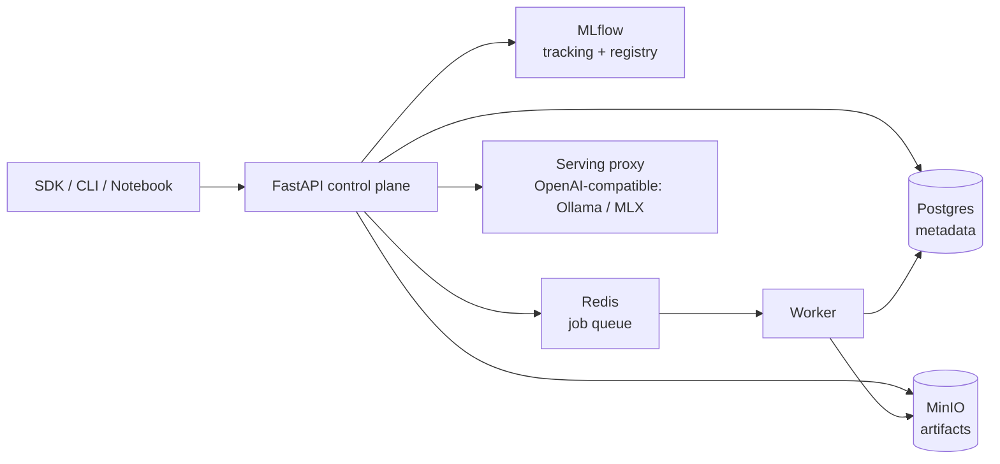

# localml

[](https://github.com/guenp/localml/actions/workflows/ci.yml)

A **local ML experimentation platform** that runs entirely on an Apple Silicon
workstation. It implements the core architecture of a production ML platform at local
scale: a Python SDK, framework adapters, experiment tracking, a model registry, artifact
storage, evaluation jobs, and local model serving.

> Status: **under active development.** The control plane (Phase 1 — durable Postgres-backed
> metadata, lifecycle, idempotency, dataset registry) and the Python SDK (Phase 2 — real HTTPX
> client, run tracking, artifact checksums, framework-adapter packaging) are implemented and
> tested. The prediction/evaluation loop and local serving proxy are next. See
> [`ROADMAP.md`](./ROADMAP.md) for status and [`docs/design.md`](./docs/design.md) for the full
> software design document.

## What's here

```
localml/
├── src/localml/          # Python SDK (`import localml as ml`)
│   ├── adapters/         # torch / jax / mlx / huggingface framework adapters
│   ├── client.py         # HTTPX client for the control plane (retry + idempotency)
│   ├── ops.py            # ml.log_metrics / log_artifact / evaluate / deploy
│   ├── datasets.py       # ml.datasets.register / get
│   ├── config.py         # env → ~/.localml/config.toml → defaults
│   ├── exceptions.py     # typed SDK errors
│   ├── run.py            # run context manager
│   ├── types.py          # Run / ModelVersion / EvaluationJob / Deployment
│   └── cli.py            # Typer CLI
├── services/
│   ├── api/              # FastAPI control plane
│   ├── worker/           # Redis-backed evaluation worker
│   └── mlflow/           # MLflow tracking + registry image
├── docs/                 # Zensical documentation site and design document
├── docker-compose.yml    # Local stack: api, worker, postgres, redis, minio, mlflow, serving
└── tests/
```

## Architecture (at a glance)



The control plane (Postgres) is the source of truth for platform metadata. MLflow holds
experiment tracking state, MinIO holds artifacts, and Redis holds transient job state.

## Quick start

### 1. Bring up the stack

```bash
cp .env.example .env
docker compose up -d
```

This starts Postgres, Redis, MinIO, MLflow, the FastAPI control plane, the worker, and a
local serving runtime.

| Service       | URL                     |
| ------------- | ----------------------- |
| Control plane | http://localhost:8000   |
| API docs      | http://localhost:8000/docs |
| MLflow UI     | http://localhost:5000   |
| MinIO console | http://localhost:9001   |

### 2. Install the SDK

```bash
uv sync           # or: pip install -e .
```

### 3. Run the example workflow

```python
import localml as ml

ml.configure(api_url="http://localhost:8000", token="local-dev-token")

with ml.start_run(project="local", config={"model": "tiny-llm"}) as run:
    ml.log_params({"batch_size": 4, "quantization": "4bit"})
    ml.log_metrics({"baseline_accuracy": 0.82})

    version = ml.huggingface.log_pretrained(
        name="tiny-assistant",
        model_dir="./models/tiny-assistant",
        metadata={"task": "chat", "runtime": "mlx"},
    )

    eval_job = ml.evaluate(
        model=version,
        dataset="datasets/eval.jsonl",
        metrics=["exact_match", "latency_p95"],
    )
    eval_job.wait()

    deployment = ml.deploy(model=version, target="local")
    print(deployment.predict({"prompt": "Explain model registries simply."}))
```

### CLI

```bash
localml --help
localml health
localml config --api-url http://localhost:8000
localml runs get <run_id>
localml models get <name>
```

## Development

Uses [`uv`](https://docs.astral.sh/uv/) for Python and dependency management; `uv.lock` is
canonical and CI runs with `UV_FROZEN=true`.

```bash
uv sync
pre-commit install

uv run pytest               # tests with coverage
uv run ruff check           # lint
uv run ruff format --check  # format check
uv run ty check src/        # type check
uv run zensical serve       # live-preview the docs
```

Docs are authored in `docs/` and built with [Zensical](https://zensical.org);
`docs.yml` deploys them to GitHub Pages on every push to `main`.

## Model lifecycle

```
created → candidate → staging → production → deprecated → archived
       ↘ failed (from candidate/staging)  ↘ archived (terminal)
```

## License

MIT. See [LICENSE](LICENSE).
