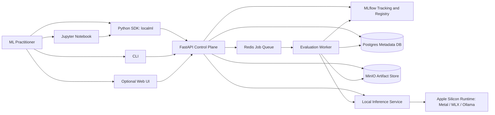
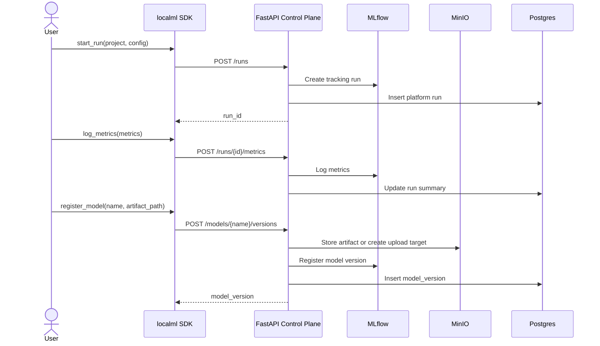
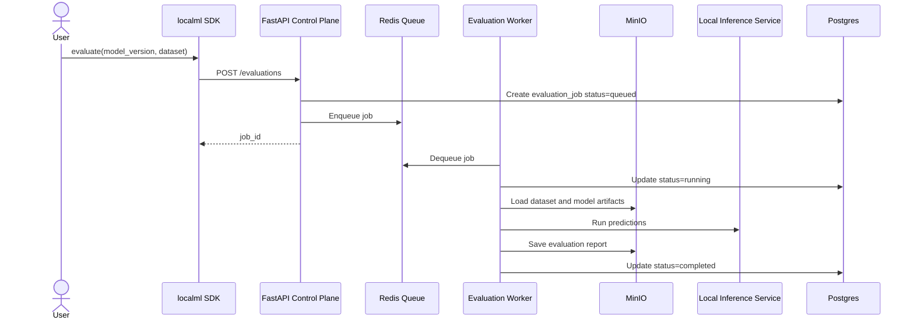
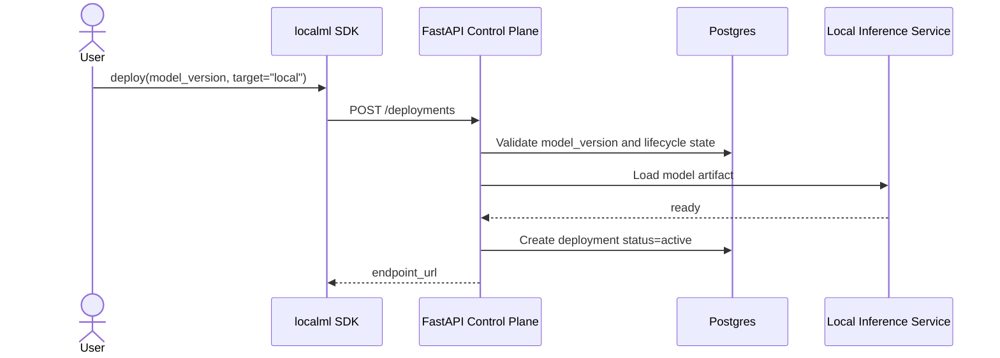
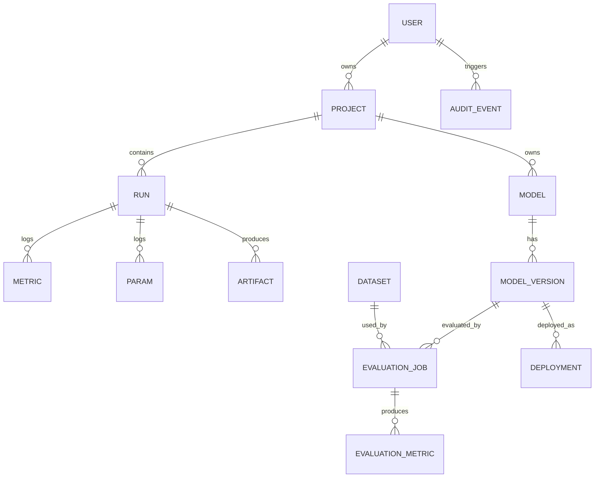
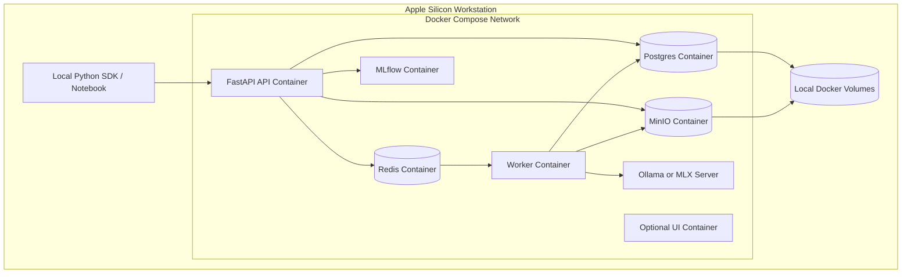
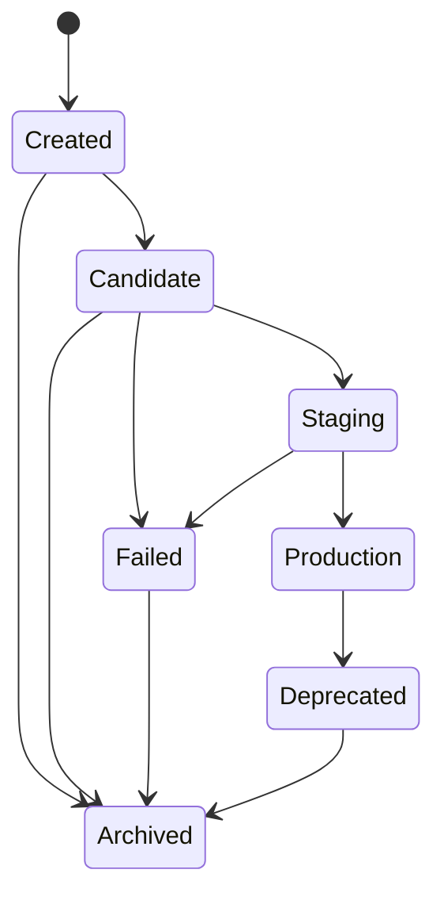

# Software Design Document: Local ML Experimentation Platform Demo

> Version 0.1 — 2026-06-05. This is the source design for the `localml` scaffold. The
> current codebase implements interfaces and a runnable in-memory control plane; see
> [`../ROADMAP.md`](../ROADMAP.md) for the path to full functionality.

## 1. Introduction

### Purpose

A local ML experimentation platform demo that runs on an Apple Silicon workstation (e.g. an
M-series Mac with large unified memory). It demonstrates the core architecture of a
production ML platform at local scale: Python SDK, framework adapters, experiment tracking,
model registry, artifact storage, evaluation jobs, and local model serving — showing how ML
practitioners move from experimentation to registration, evaluation, and local deployment
through a coherent developer-facing platform.

### Scope

In scope:

- Local deployment using Docker Compose.
- FastAPI-based platform control plane.
- MLflow-backed experiment tracking and model registry integration.
- Postgres metadata store.
- MinIO object storage for artifacts.
- Redis-backed background job queue.
- Local model serving through Ollama or an MLX-compatible server.
- Framework adapters for PyTorch, JAX, MLX, and Hugging Face.
- Simple evaluation jobs and local deployment records.

Out of scope (MVP): multi-node distributed training, production Kubernetes scheduling,
multi-tenant enterprise RBAC, cloud deployment, accelerator autoscaling, full dataset
versioning, production compliance workflows, large-scale inference traffic management.

### Definitions

| Term              | Definition                                                                            |
| ----------------- | ------------------------------------------------------------------------------------- |
| SDK               | Python toolkit ML practitioners use to interact with the platform.                    |
| MLX               | Apple's ML array framework optimized for Apple Silicon.                               |
| MLflow            | Open-source experiment tracking and model registry.                                   |
| MinIO             | S3-compatible local object storage for artifacts.                                     |
| Model Registry    | System of record for model names, versions, artifacts, metadata, lifecycle state.     |
| Artifact          | File/dir produced by an experiment (weights, configs, reports, logs).                 |
| Evaluation Job    | Background job that evaluates a model version against a dataset and records metrics.   |
| Control Plane     | Backend API + services managing metadata, jobs, registry state, lifecycle.            |
| Serving Runtime   | Local inference service that loads a model and exposes prediction/chat APIs.          |
| Framework Adapter | SDK module translating framework-specific formats into shared platform primitives.    |

## 2. System Overview

A developer-facing ML platform running entirely on a local Apple Silicon workstation. Users
interact through a Python SDK, CLI, notebook, REST API, or optional web UI. Framework
adapters convert model artifacts/checkpoints into shared platform concepts. The control
plane manages experiments, model versions, evaluations, jobs, deployments, metadata, and
artifacts.

### Design goals

1. **Developer experience** — clean, notebook-friendly Python SDK.
2. **Framework-native integration** — PyTorch/JAX/MLX/HF in familiar patterns.
3. **Framework-neutral platform core** — common primitives for experiments, artifacts,
   models, evaluations, deployments, jobs.
4. **Local reproducibility** — entire system via Docker Compose, local services.
5. **Extensibility** — add adapters, serving backends, evaluation types without redesign.
6. **Demo clarity** — show architecture, SDK design, backend APIs, lifecycle thinking.

### System context



## 3. Architectural Design

Modular local service architecture orchestrated by Docker Compose. Clear service
boundaries, not a microservices-heavy production platform.

### Technology stack

| Layer               | Technology                                    |
| ------------------- | --------------------------------------------- |
| SDK                 | Python, Pydantic, HTTPX, Typer                |
| API                 | FastAPI, Uvicorn                              |
| Experiment Tracking | MLflow                                        |
| Metadata            | Postgres                                      |
| Artifact Storage    | MinIO                                         |
| Queue               | Redis                                         |
| Worker              | Custom Python worker (RQ/Celery/Dramatiq opt) |
| Serving             | Ollama or MLX-LM server                       |
| UI                  | MLflow UI, optional Streamlit                 |
| Packaging           | uv / Hatchling                                |
| Infrastructure      | Docker Compose                                |
| Observability       | Structured logs, optional OpenTelemetry       |
| Testing             | Pytest, Ruff, MyPy, HTTPX test client         |

### Experiment + model registration flow



### Evaluation flow



### Local deployment flow



## 4. Detailed Design

### 4.1 Python SDK (`localml`)

Provides the primary developer interface, hides service complexity, exposes high-level
lifecycle APIs, provides framework adapters, and handles errors/retries/polling/local
config.

Public API:

```python
import localml as ml

with ml.start_run(project="demo", config={"lr": 0.001}) as run:
    ml.log_metrics({"accuracy": 0.91})
    ml.log_artifact("outputs/model.safetensors")
    version = ml.mlx.log_model(name="local-assistant", model_dir="./model",
                               metadata={"task": "chat"})
    job = ml.evaluate(model=version, dataset="datasets/eval.jsonl",
                      metrics=["accuracy", "latency_p95"])
    job.wait()
    deployment = ml.deploy(model=version, target="local")
```

Typed exceptions: `LocalMLError`, `AuthenticationError`, `ValidationError`,
`ArtifactUploadError`, `ModelRegistrationError`, `EvaluationFailedError`, `DeploymentError`.

Data structures: `Run`, `ModelVersion`, `EvaluationJob`, `Deployment`.

State: local config in `~/.localml/config.toml`; current run in context-local state; server
is source of truth.

### 4.2 Framework adapters

Stateless modules that serialize artifacts, capture framework-specific metadata, and call
the shared registration path:

- `localml.torch.log_model(model, name, example_input=..., metadata=...)` — state_dict,
  config, I/O schema, PyTorch version, deps.
- `localml.jax.log_checkpoint(name, params=..., state=..., checkpoint_format="orbax")` —
  PyTree params, training state, Orbax dir, shape/dtype, JAX version, sharding.
- `localml.mlx.log_model(name, model_dir, quantization="4bit")` — MLX files, tokenizer,
  quantization, MLX version, Apple Silicon runtime metadata.
- `localml.huggingface.log_pretrained(name, model_dir)` — config.json, tokenizer,
  safetensors/bin, generation config, HF metadata.

### 4.3 FastAPI control plane

Exposes REST APIs, validates requests, manages lifecycle, coordinates MLflow/Postgres/
MinIO/Redis/serving, provides OpenAPI schema.

Core endpoints:

```text
POST   /projects                 GET /projects/{id}
POST   /runs                     GET /runs/{id}
POST   /runs/{id}/metrics
POST   /runs/{id}/params
POST   /runs/{id}/artifacts
POST   /models/{name}/versions   GET /models/{name}
GET    /models/{name}/versions/{version}
POST   /models/{name}/versions/{version}/promote
POST   /evaluations              GET /evaluations/{id}
POST   /deployments              GET /deployments/{id}    DELETE /deployments/{id}
```

Errors: 400 validation, 404 not found, 409 lifecycle conflict, 422 invalid transition,
500 internal. Log request ID; preserve audit trail for mutations.

Lifecycle transitions: `created → candidate → staging → production`; `failed`, `archived`,
`deprecated` as terminal/special states. Source of truth: Postgres (metadata), MLflow
(tracking), MinIO (artifacts), Redis (transient queue state).

### 4.4 Background worker

Executes evaluation jobs: fetch metadata → resolve model artifacts + dataset → run loop →
compute metrics → save report to MinIO → log metrics to MLflow → update Postgres. On
failure: mark `failed`, store reason + traceback summary, bounded retries, preserve partial
logs.

### 4.5 Local inference service

Serves registered models locally. Endpoints: `POST /load`, `POST /predict`,
`POST /v1/chat/completions`, `GET /health`, `GET /models`. Backends: Ollama, MLX, or a
simple custom wrapper. Reports load failures to the control plane.

## 5. Database Design



Tables: `users`, `projects`, `runs`, `metrics`, `params`, `artifacts`, `models`,
`model_versions`, `datasets`, `evaluation_jobs`, `evaluation_metrics`, `deployments`,
`audit_events`. Full column definitions live in the ORM models at
`services/api/app/db.py`.

Migrations: Alembic; additive where possible; avoid destructive changes in MVP; seed a
default local user + demo project; provide a reset script.

## 6. External Interfaces

MVP user interfaces: Python SDK, CLI, MLflow UI, optional Streamlit dashboard. External
service APIs: FastAPI control plane (REST/JSON), MLflow Tracking API, MinIO (S3),
Redis protocol, Ollama (REST/OpenAI-compatible), MLX server. Targets Apple Silicon,
unified memory, Metal/MLX runtime, local Docker volumes.

## 7. Security Considerations

MVP: local dev bearer token in `~/.localml/config.toml`; default local mode may bypass
auth for demos. Single-user / simple project-ownership authorization. Local-only data in
MinIO/Postgres volumes. No formal compliance target.

Future: OIDC, mTLS service-to-service, fine-grained RBAC (viewer/contributor/maintainer/
admin), encryption at rest, signed artifact manifests, secret management, retention
policies.

## 8. Performance and Scalability

MVP assumptions: single primary user, 1–5 concurrent clients, 1–3 background jobs,
artifacts from MBs to tens of GBs, local inference of small/medium models. Indexes on
project/model/version/status/job foreign keys (see ORM). Vertical scaling on the local
workstation; keep serving single-node. Future: Kubernetes, horizontal API/worker scaling,
distributed object storage, queue-based autoscaling, multi-model routing, accelerator
scheduling.

## 9. Deployment Architecture

Environments: Local Dev (Docker Compose, local volumes) and Local Demo (stable seed data,
reproducible scripts, optional preloaded model). CI/CD: lint → typecheck → unit → API →
integration (Compose stack) → package → demo smoke test.



## 10. Testing Strategy

Unit (Pytest/Ruff/MyPy): SDK request construction + error handling, adapter serialization,
API validation, lifecycle transitions, worker job handling, repository logic. Integration:
Docker Compose stack covering create project → run → log → artifact → register → evaluate →
deploy → query endpoint. E2E demo: start stack, run notebook/script, train/load small
model, log, register, evaluate, promote, deploy, call inference, validate. Quality gates:
SDK coverage >80%, API route coverage >80%, docstrings on public SDK methods, OpenAPI
schema checked in, smoke test passes from clean Compose start, demo under 10 min on target
hardware.

## 11. Appendices

### Appendix B: Model lifecycle states



### Appendix D: Change history

| Version | Date       | Author                              | Changes                          |
| ------- | ---------- | ----------------------------------- | -------------------------------- |
| 0.1     | 2026-06-05 | Guenevere Prawiroatmodjo / ChatGPT  | Initial SDD draft.               |
