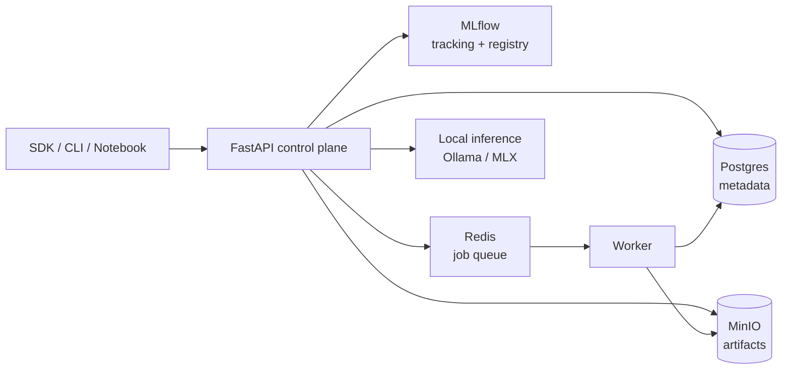

# localml

A local ML experimentation platform demo that runs entirely on an Apple Silicon
workstation. It demonstrates the core architecture of a production ML platform at local
scale: a Python SDK, framework adapters, experiment tracking, a model registry, artifact
storage, evaluation jobs, and local model serving.

## Install

```sh
pip install localml
```

## Quickstart

```python
import localml as ml

ml.configure(api_url="http://localhost:8000", token="local-dev-token")

with ml.start_run(project="local-demo", config={"model": "tiny-llm"}):
    ml.log_params({"batch_size": 4})
    ml.log_metrics({"baseline_accuracy": 0.82})
```

## Architecture



The control plane is the source of truth for platform metadata. MLflow holds experiment
tracking state and model registry records, MinIO stores artifacts, and Redis carries
transient evaluation job state for the worker.
